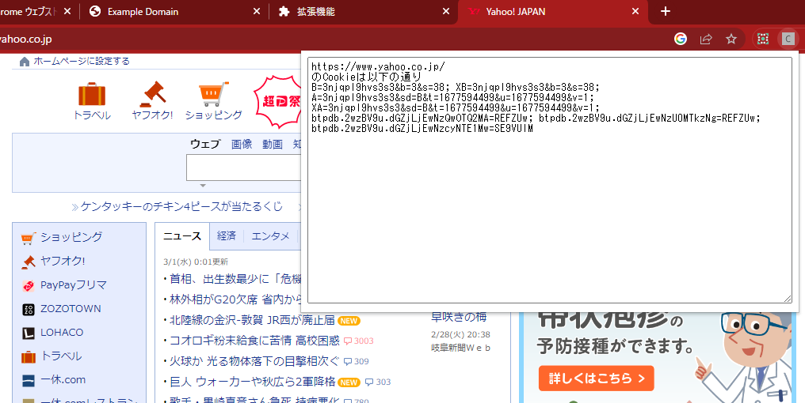

# chrome manifest V3でcookieは取れるのか？
の、技術検証。

# 使い方
このレポジトリをzipでDL。
(githubの場合、右上の緑色の＜＞code からdownload ZIP でok)
「chrome パッケージ化されていない拡張機能を読み込む」でググって入れる。
使う。

この拡張を有効にしてから、ページを読み込むこと！

# 解説
サービスワーカーでlocalStorageが使えないからIndexedDBを使うのが面倒だったくらいで、
それ以外はchrome APIの標準機能だけ。
manifest V3でも通信内容を覗き見る拡張は出来るらしい。

service-worker.js で `chrome.webRequest` APIを使って通信内容をタブごとにキャッチしてindexedDBに保存。
ポップアップを開いた時はpopup.js でindexedDBからタブIDで通信内容を検索して表示するだけ。